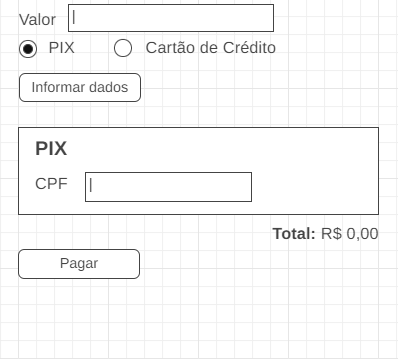
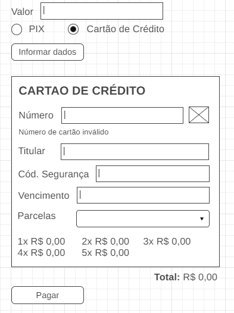

# 💳 Página de Pagamento | Payment Page  
Implementação de comportamentos interativos com **JavaScript** para simular um fluxo de pagamento online.  
Interactive behavior implementation using **JavaScript** to simulate an online payment flow.  

---

## 📌 Contexto | Context

Em um novo projeto da empresa, foi necessário aplicar conhecimentos em **JavaScript** para implementar o comportamento de uma página de pagamento em um site de compras.  
Os métodos de pagamento disponíveis são **Pix** e **Cartão de Crédito**, e a página deve reagir conforme a opção selecionada, exibindo os campos necessários e calculando corretamente os valores, considerando **descontos e juros aplicáveis**.  

In a new company project, it was required to apply **JavaScript** knowledge to implement the behavior of a payment page in an e-commerce website.  
The available payment methods are **Pix** and **Credit Card**, and the page should dynamically adapt to the selected option, displaying the necessary fields and correctly calculating the amounts, considering **discounts and interest rates**.  

---
## Wireframes

---
## 🚧 Status do projeto | Project Status

- 🟢 Finalizado | Completed  
- ✅ Estrutura e layout prontos com HTML e CSS | Structure and layout completed with HTML and CSS
  
---
## 🎯 Funcionalidades Implementadas | Implemented Features

  - Exibir mensagem de alerta se o campo de valor estiver vazio ao clicar em **"Informar dados"** | Display an alert message if the amount field is empty when clicking **"Enter data"**.
  - Para pagamentos com **Pix**, aplicar **10% de desconto** e exibir painel com as informações | For **Pix** payments, apply **10% discount** and show the panel with payment details.
  - Para **Cartão de Crédito**, exibir formulário e: | For **Credit Card**, display the form and:
    - Detectar bandeira do cartão pelo início da numeração: | Detect card brand based on initial numbers: 
      - "1234" → Ícone A | Icon A 
      - "4321" → Ícone B | Icon B 
      - Outros → Mostrar "Número de cartão inválido" | Others → Show "Invalid card number".
    - Calcular parcelamento: | Calculate installments: 
      - 1 - 3 parcelas → sem juros | installments → no interest  
      - 4 parcelas → +5% de juros | installments → +5% interest  
      - 5 parcelas → +10% de juros | installments → +10% interest
    - Atualizar total ao selecionar número de parcelas | Update total when selecting number of installments.
  - Exibir mensagem de sucesso ao clicar em **"Pagar"** | Show a success message upon clicking **"Pay"**.
  - Garantir que **somente um painel (Pix ou Cartão)** seja exibido por vez | Ensure **only one panel (Pix or Card)** is displayed at a time.

---

## 🛠 Tecnologias Utilizadas | Technologies Used

- HTML5  
- CSS3  
- JavaScript  
- VS Code  
